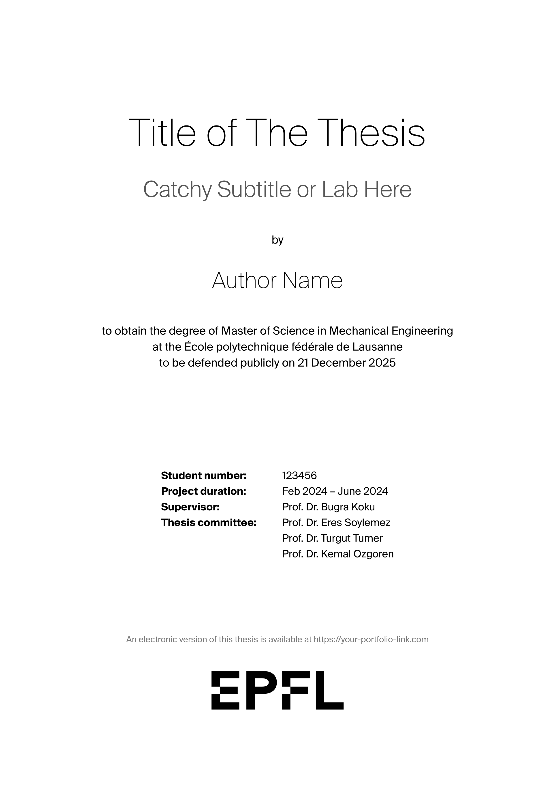
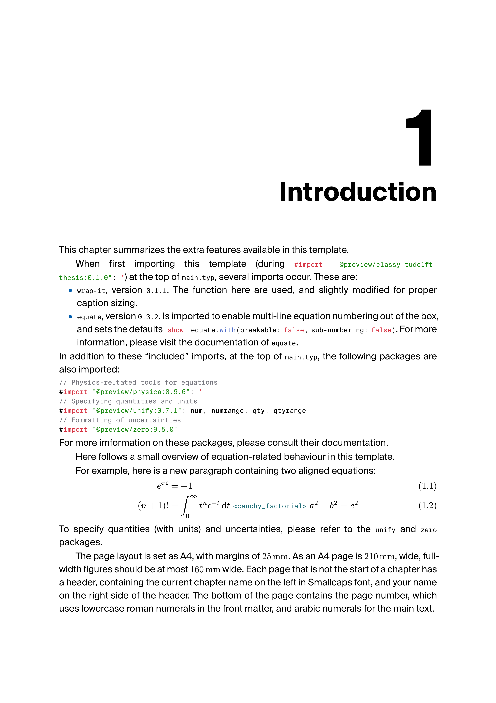
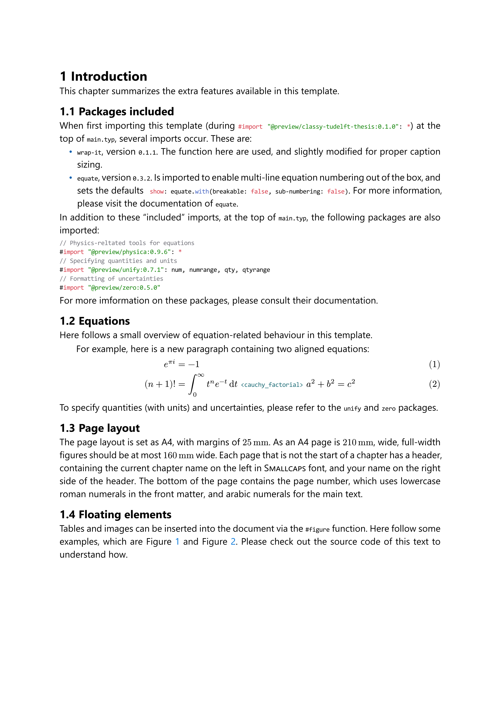

# 🎓 Unofficial EPFL Typst Academic Template

[](https://typst.app)
[](https://opensource.org/licenses/MIT)

A professional, modern Typst template for theses, reports, and articles. While styled after the **EPFL (École Polytechnique Fédérale de Lausanne)** visual identity, this is an **unofficial** template and is not endorsed by the institution.

[**View Demo PDF**](#) | [**Report a Bug**](https://github.com/alifuatsahin/epfl-thesis-template/issues)

---

## ✨ Previews

| Cover Page | Title Page | Main Text (Book) | Main Text (Report) |
| :---: | :---: | :---: | :---: |
|  |  |  |  |

---

## 🚀 Quick Start

The fastest way to start your thesis is using the Typst CLI:

1. **Install locally:**
   Clone this repo into your local Typst packages folder:
   ```bash
   # macOS/Linux
   git clone https://github.com/yourusername/epfl-thesis.git ~/.local/share/typst/packages/local/epfl-thesis/0.1.0
   ```

2. **Initialize project:**
   ```bash
   typst init @local/epfl-thesis:0.1.0 my-thesis
   cd my-thesis
   ```

3. **Compile:**
   ```bash
   typst watch main.typ --font-path ./src/epfl
   ```

---

## 🛠 Features

- **🎯 Dual Modes:** Toggle between `doc-type: "book"` (for theses with chapters) and `doc-type: "article"` (for semester reports/papers).
- **🧪 Science-Ready:**
    - `chem()`: Effortless chemical formulas via `chem[H2O]`.
    - `wrap-content()`: Advanced figure wrapping where captions intelligently match image widths.
- **🎨 EPFL Identity:** Includes official Swiss Red color schemes and "Suisse Int'l" font integration.
- **📚 Modular Structure:** Pre-organized folder structure for sections, references, and appendices.
- **🔢 Automatic Numbering:** Handles complex appendix numbering (A.1, B.2) automatically.

---

## 📖 Usage Guide

In your `main.typ`, the template is initialized using the `base` show rule:

```typst
#import "@local/epfl-thesis:0.1.0": *

#show: base.with(
  doc-type: "book", // "book" or "article"
  title: "Neural Network Optimization in Cryo-EM",
  name: "Claude Shannon",
  supervisor: "Prof. Jane Doe",
  date: "December 2023",
)

// Generate the high-impact cover
#makecoverpage(
  title: "Neural Network Optimization", 
  name: "Claude Shannon", 
  img: image("src/epfl/rlc-cover2.jpg")
)

// Standard institutional title page
#maketitlepage()

#outline(indent: auto)

= Introduction
Your research starts here...
```

### Key Parameters (`base` function)
| Parameter | Type | Default | Description |
| :--- | :--- | :--- | :--- |
| `doc-type` | string | `"book"` | Changes layout between thesis/report styles. |
| `title` | string | (required) | The main title of your document. |
| `author` | string | (required) | Your full name. |
| `accent-color` | color | `rgb("#FF0000")` | The primary theme color (EPFL Red). |

---

## 📂 Project Structure

```text
.
├── typst.toml          # Package metadata
├── src/                # Logic & Assets
│   ├── lib.typ         # API Entrypoint
│   ├── template.typ    # Styling & Layout rules
│   └── epfl/           # Fonts (.otf) and Logos (.svg)
├── template/           # Starter Kit
│   ├── main.typ        # Main file to compile
│   ├── references.bib  # Bibliography
│   └── sections/       # Separate .typ files for chapters
└── README.md
```

---

## ⚠️ Disclaimer & Fonts

*   **Disclaimer:** This project is **not** officially affiliated with EPFL. It is a community-driven tool to help students produce beautiful documents.
*   **Fonts:** To strictly follow EPFL branding, this template (optionally) uses **Suisse Int'l**.

## 📄 License

Based on [EPFL-Report-Template](https://github.com/batuhanfaik/EPFL-Report-Template) and [tudelft-thesis-template](https://github.com/Vector04/tudelft-thesis-template).
Licensed under the **MIT License**.
